# Findings: When Metrics Mistake Fidelity for Quality

**Corpus:** 10 Ukrainian translations of George Orwell's *Animal Farm* — 7 human (1947–2021) + 3 AI (GPT-5.2, DeepL, LaPa). 1,367 aligned segments.

---

## The One-Paragraph Story

Every automatic metric we tested — COMET, XCOMET, COMETKiwi, MetricX-24, LaBSE, chrF — places all three AI translations at the top. Yet when we strip away the English source and ask "which sentence is more literary?", the ranking inverts completely: humans rise, AI sinks. The metrics aren't wrong — they're measuring the wrong thing. They reward semantic fidelity and surface fluency, which AI systems optimize for. But literary translation lives in a different space: lexical richness, discourse particles, diminutive morphology, cultural adaptation, stylistic voice. On every one of these dimensions, AI systems are measurably impoverished. And the three AI systems — despite being architecturally distinct (general LLM, commercial NMT, domain-tuned LLM) — converge on essentially the same output, while human translators genuinely diverge. This isn't a model-specific bug. It's a structural property of AI translation.

---

## 1. Neural Metrics: AI Sweeps the Board

### 1.1 Reference-Free Metrics

Four reference-free neural metrics, each using a different model architecture, all produce the same ranking: **AI top-3, Dybko dead last**.

| Rank | System | COMETKiwi-22 | COMETKiwi-XL | XCOMET-XXL | MetricX-24 QE |
|------|--------|:---:|:---:|:---:|:---:|
| 1 | **LaPa** | 0.820 | 0.717 | 0.880 | **3.30** |
| 2 | **GPT-5.2** | 0.812 | 0.711 | 0.889 | **3.50** |
| 3 | **DeepL** | 0.805 | 0.697 | **0.907** | **3.65** |
| 4 | Stelmakh 2021 | 0.775 | 0.651 | 0.781 | 4.28 |
| 5 | Shevchuk 1991 | 0.738 | 0.580 | 0.714 | 5.29 |
| 6 | Cherniatynskyi 1947 | 0.738 | 0.574 | 0.693 | 5.60 |
| 7 | Nosenok 2020 | 0.727 | 0.577 | 0.714 | 5.24 |
| 8 | Drozdovskyi 1991 | 0.693 | 0.553 | 0.644 | 5.61 |
| 9 | Okolitenko 1992 | 0.672 | 0.500 | 0.647 | 6.70 |
| 10 | Dybko 1984* | 0.541 | 0.307 | 0.375 | 11.19 |

*COMETKiwi/XCOMET: higher = better. MetricX-24: lower = better. Dybko is a free cultural adaptation (sanity check).*

**Group gap:** AI averages 0.812 on COMETKiwi-22 vs. humans' 0.724 (excl. Dybko) — a +0.088 gap. On MetricX-24 QE, AI averages 3.48 vs. humans' 5.45 — AI translations are scored as nearly twice as good.

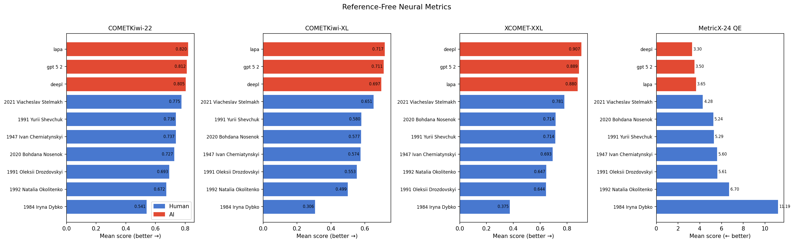

### 1.2 Round-Robin Reference-Based Metrics

When each translation is scored using every other translation as reference, the same hierarchy holds:

| Rank | System | COMET-22 RR | XCOMET RR | MetricX-24 RR |
|------|--------|:---:|:---:|:---:|
| 1 | **GPT-5.2** | 0.816 | 0.794 | **4.68** |
| 2 | **DeepL** | 0.813 | **0.818** | **4.30** |
| 3 | **LaPa** | 0.813 | 0.784 | **4.77** |
| 4 | Stelmakh 2021 | 0.790 | 0.716 | 5.19 |
| 5 | Shevchuk 1991 | 0.779 | 0.702 | 6.42 |
| 6 | Cherniatynskyi 1947 | 0.772 | 0.668 | 7.05 |
| 7 | Nosenok 2020 | 0.771 | 0.680 | 6.32 |
| 8 | Drozdovskyi 1991 | 0.748 | 0.647 | 6.74 |
| 9 | Okolitenko 1992 | 0.738 | 0.621 | 8.09 |
| 10 | Dybko 1984 | 0.667 | 0.439 | 12.94 |

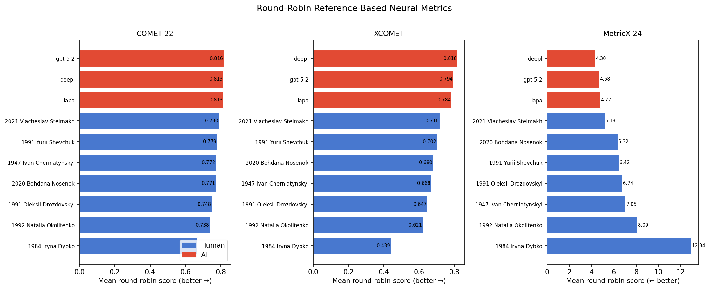

### 1.3 Pairwise Heatmaps: The AI Block

The heatmaps reveal a striking visual pattern. The bottom-right 3x3 block (AI-AI pairs) is consistently the "hottest" — highest similarity scores across all three metrics. The top-left 7x7 block (human-human) is cooler and more varied. Dybko's row is uniformly cold.

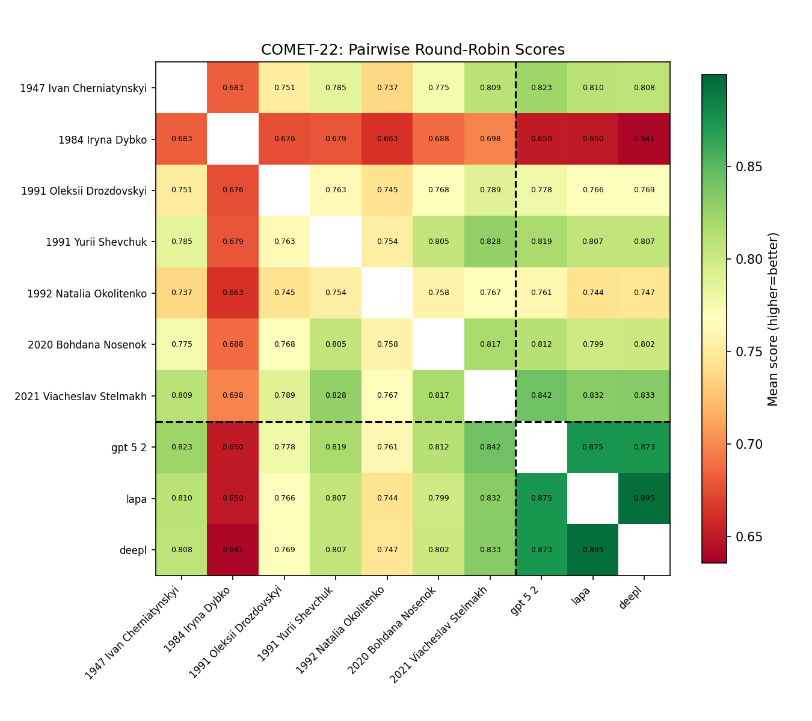

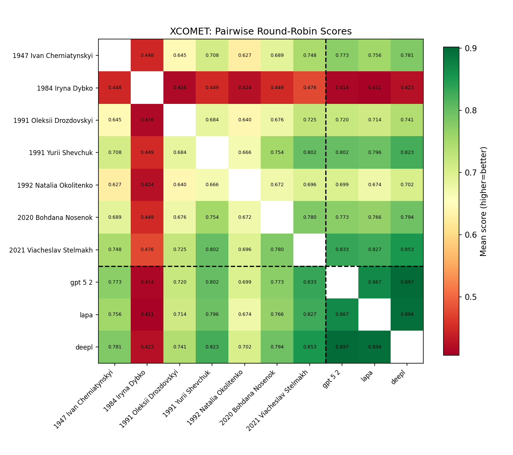

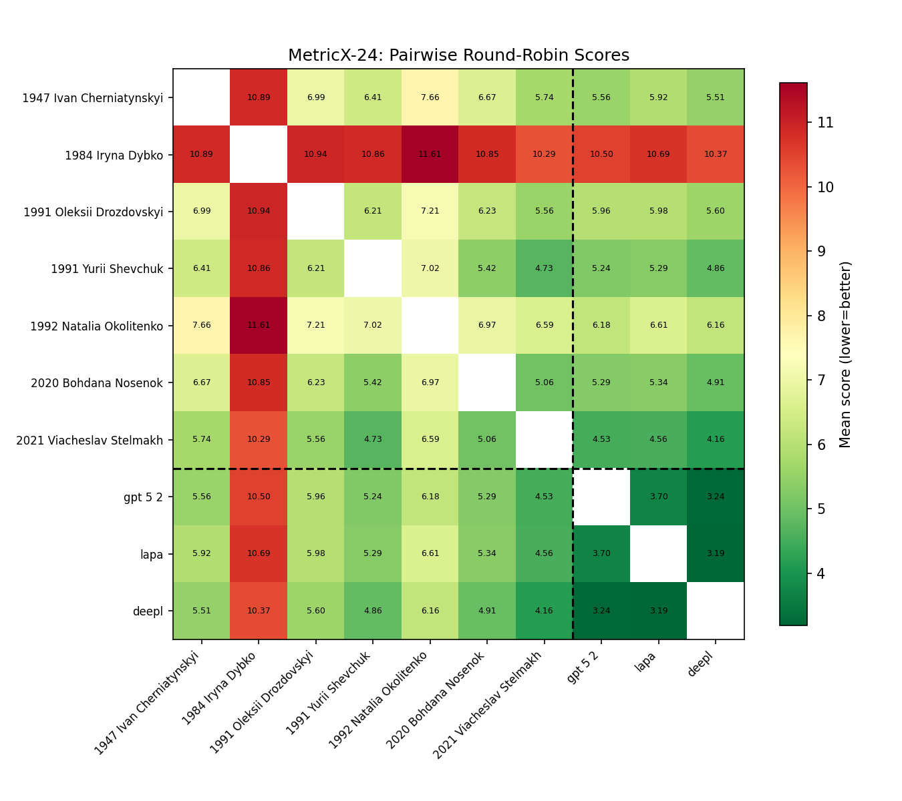

### 1.4 Convergence: AI-AI vs Human-Human

Round-robin scores double as a convergence measure. When system A scores high using system B as reference, they are similar.

| Metric | AI-AI avg | Human-Human avg | Cross avg | Gap |
|--------|:---------:|:---------------:|:---------:|:---:|
| COMET-22 | 0.881 | 0.750 | 0.776 | +0.131 |
| XCOMET | 0.886 | 0.627 | 0.718 | +0.259 |
| MetricX-24 | 3.38 | 7.61 | 6.15 | -4.23 |

AI translations score dramatically higher (or lower for MetricX) when compared to each other than humans do when compared to each other. The three AI systems have converged on essentially the same translation.

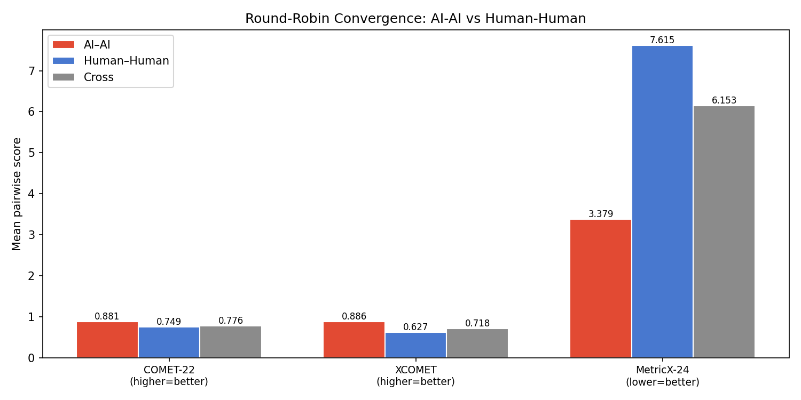

---

## 2. Semantic Similarity: The Convergence Is Real

LaBSE cross-lingual embeddings (1,142 segments) confirm the convergence pattern independently of MT metrics:

| Pair type | Mean cosine similarity | N pairs |
|-----------|:----------------------:|:-------:|
| **AI-AI** | **0.941** | 3 |
| Human-AI | 0.782 | 21 |
| Human-Human | 0.711 | 21 |

The three individual AI-AI pairs: LaPa-DeepL **0.952**, GPT-DeepL **0.940**, LaPa-GPT **0.932**. These are essentially the same translation.

**Proximity to English source** (LaBSE cosine similarity):

| System | Similarity to source |
|--------|:---:|
| LaPa | 0.856 |
| DeepL | 0.849 |
| GPT-5.2 | 0.845 |
| Cherniatynskyi 1947 | 0.783 |
| Stelmakh 2021 | 0.777 |
| Shevchuk 1991 | 0.758 |
| Nosenok 2020 | 0.720 |
| Drozdovskyi 1991 | 0.694 |
| Okolitenko 1992 | 0.667 |
| Dybko 1984 | 0.531 |

All AI systems sit above 0.845. The closest human (Cherniatynskyi, 0.783) is 6 points below. AI translations are measurably more "English" than any human translation.

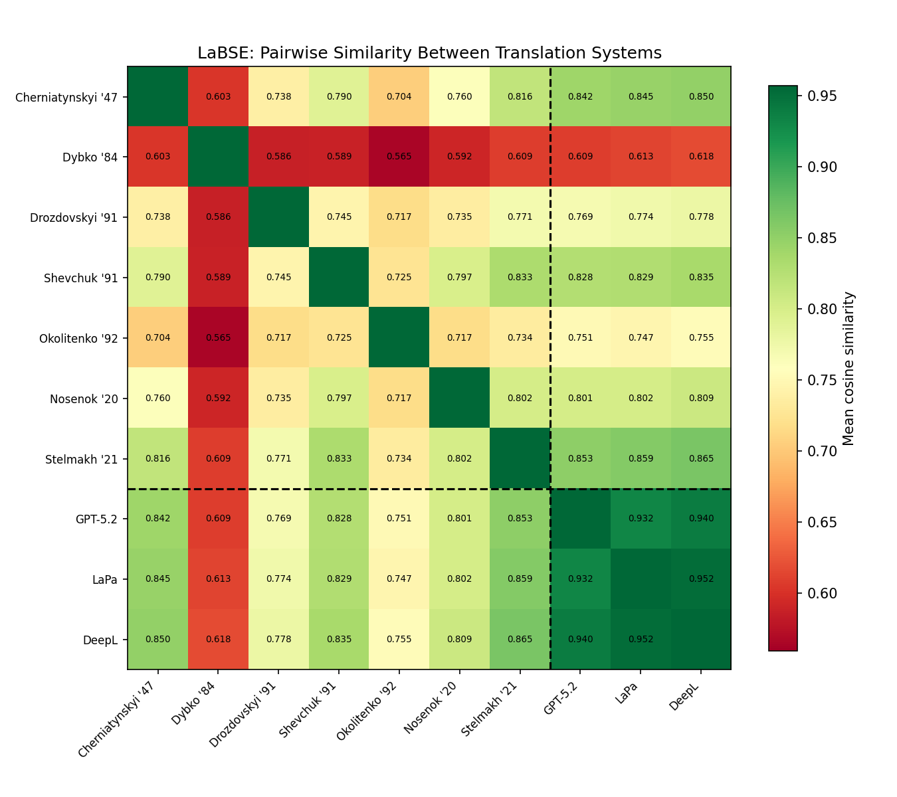

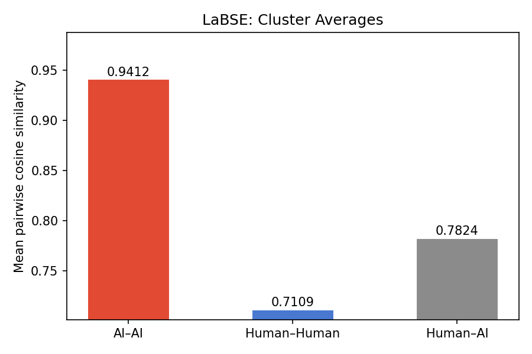

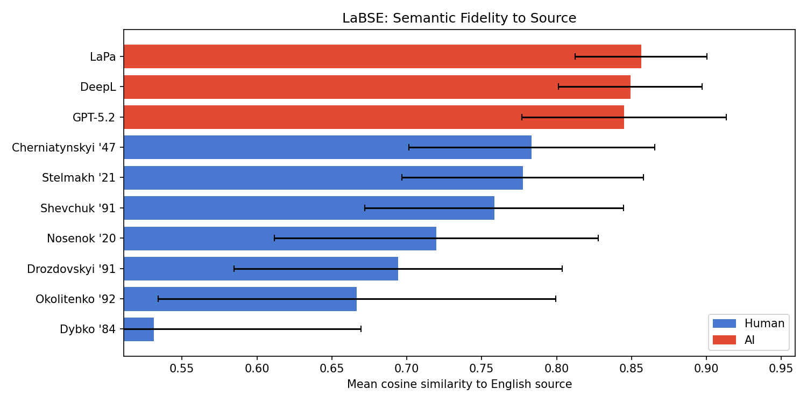

---

## 3. Stylometry: What the Metrics Miss

### 3.1 Lexical Diversity — AI Is Impoverished

| Metric | AI avg | Human avg (excl. Dybko) | Gap |
|--------|:------:|:-----------------------:|:---:|
| MTLD | 311 | 377 | -18% |
| MATTR | 0.844 | 0.857 | -1.5% |
| Hapax ratio | 0.182 | 0.215 | -15% |
| Top-100 concentration | 0.394 | 0.377 | +4.5% |

All three AI systems fall below the human range on MTLD. DeepL (301) and LaPa (303) are the most impoverished; GPT-5.2 (328) is marginally better but still below every human except Dybko. AI systems rely on a smaller vocabulary, repeating common words more often.

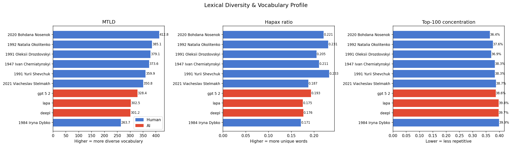

### 3.2 Discourse Particles — The Clearest AI Fingerprint

Ukrainian discourse particles (ж, таки, ось, бо, аж, ну, мов, наче) signal emphasis, surprise, hedging — pragmatic nuances with no direct English equivalents.

| System | Particles /1k tokens |
|--------|:---:|
| Drozdovskyi 1991 | 10.1 |
| Dybko 1984 | 6.8 |
| Cherniatynskyi 1947 | 5.1 |
| Okolitenko 1992 | — |
| Shevchuk 1991 | — |
| Stelmakh 2021 | — |
| Nosenok 2020 | — |
| **LaPa** | — |
| **GPT-5.2** | — |
| **DeepL** | — |

*(Full breakdown in the discourse particles plot.)*

GPT-5.2 and DeepL use roughly 2x fewer particles than most human translators. LaPa partially closes the frequency gap thanks to Ukrainian fine-tuning, but concentrates on a single particle — a telltale sign of pattern memorization rather than genuine pragmatic competence.

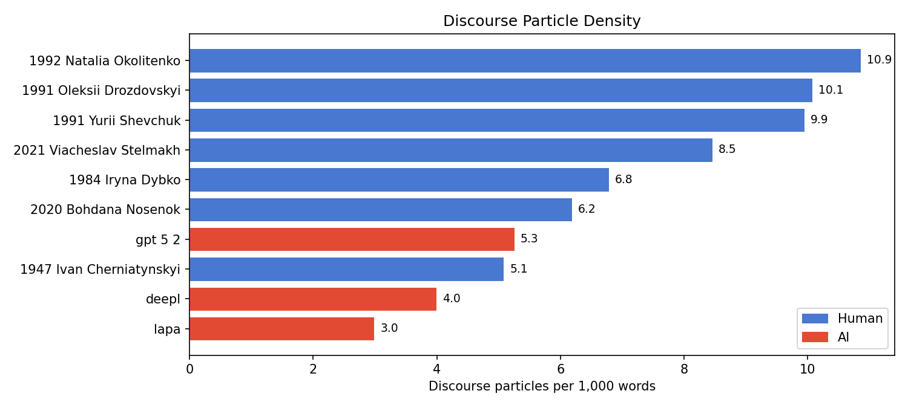

### 3.3 Diminutive Morphology — AI Strips Ukrainian Expressiveness

Diminutive suffixes (-еньк-, -очк-, -ик, -оньк-, -ечк-) are a core expressive device in Ukrainian prose.

| System | Diminutives /1k |
|--------|:---:|
| Dybko 1984 | 2.34 |
| Okolitenko 1992 | 2.81 |
| Drozdovskyi 1991 | 1.36 |
| Stelmakh 2021 | 1.13 |
| Shevchuk 1991 | 0.99 |
| Nosenok 2020 | 0.65 |
| Cherniatynskyi 1947 | 0.47 |
| **LaPa** | **0.50** |
| **DeepL** | **0.47** |
| **GPT-5.2** | **0.44** |

Human average (excl. Dybko): 1.23 /1k. AI average: 0.47 /1k — a **2.6x gap**. AI systems systematically under-produce a fundamental Ukrainian morphological device.

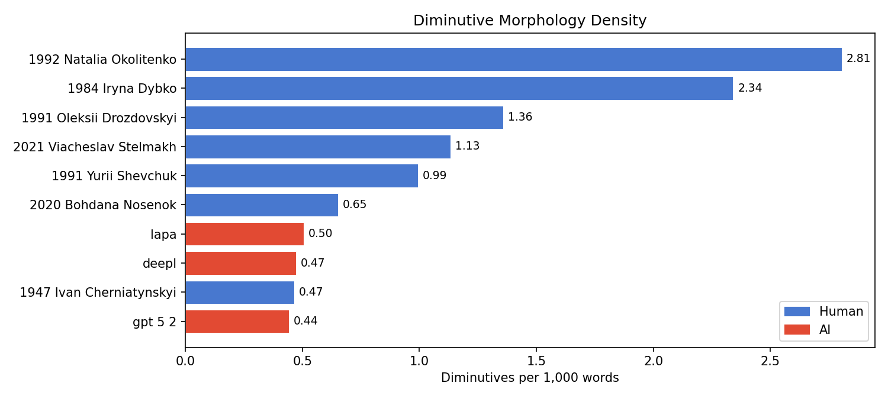

### 3.4 Surface Overlap (chrF/BLEU) — AI Is More Source-Literal

| System | Mean pairwise chrF | Mean pairwise BLEU |
|--------|:---:|:---:|
| **DeepL** | **44.0** | **18.7** |
| **LaPa** | **42.5** | **17.2** |
| **GPT-5.2** | **42.7** | **17.0** |
| Stelmakh 2021 | 38.2 | 11.9 |
| Shevchuk 1991 | 37.0 | 10.7 |
| Nosenok 2020 | 35.8 | 10.6 |
| Cherniatynskyi 1947 | 35.3 | 8.9 |
| Drozdovskyi 1991 | 34.0 | 7.3 |
| Okolitenko 1992 | 31.5 | 7.7 |
| Dybko 1984 | 23.5 | 2.4 |

AI translations are 15–20% more similar to each other at the surface level (chrF) than any pair of human translations. The three AI systems form a tight cluster; humans spread across a much wider range.

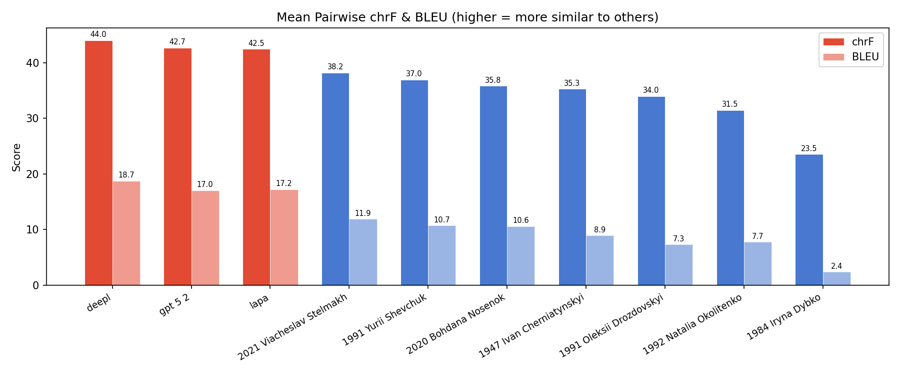

### 3.5 Cosine Delta — Stylometric Fingerprint

Using function-word lemma frequencies (content-independent stylistic markers), Cosine Delta measures stylistic distance between translations.

| System | Mean pairwise distance |
|--------|:---:|
| Dybko 1984 | 1.160 |
| Cherniatynskyi 1947 | 1.140 |
| Drozdovskyi 1991 | 1.137 |
| Okolitenko 1992 | 1.128 |
| Stelmakh 2021 | 1.116 |
| Shevchuk 1991 | 1.103 |
| Nosenok 2020 | 1.095 |
| **LaPa** | **1.068** |
| **GPT-5.2** | **1.059** |
| **DeepL** | **1.058** |

The three AI systems cluster at the bottom — they are the most stylistically central (closest to each other) by a content-independent measure. They pick from the same narrow corner of the function-word space.

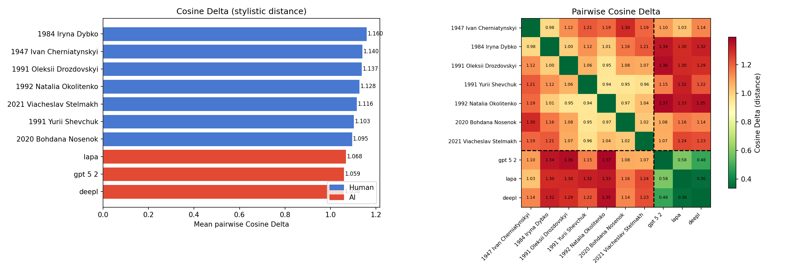

### 3.6 Word Ratio Std — Segment-Level Uniformity

| System | Word ratio std |
|--------|:---:|
| **LaPa** | **0.127** |
| Cherniatynskyi 1947 | 0.155 |
| Shevchuk 1991 | 0.172 |
| Stelmakh 2021 | 0.188 |
| Nosenok 2020 | 0.207 |
| **GPT-5.2** | **0.246** |
| **DeepL** | **0.132** |
| Okolitenko 1992 | 0.240 |
| Drozdovskyi 1991 | 0.323 |
| Dybko 1984 | 0.553 |

LaPa and DeepL are the most uniform systems — they maintain a near-constant ratio of Ukrainian words to English words across segments. Human translators vary more: they expand some segments and compress others, adapting to content.

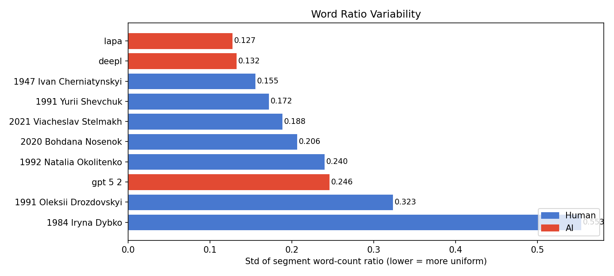

### 3.7 Convergence Summary

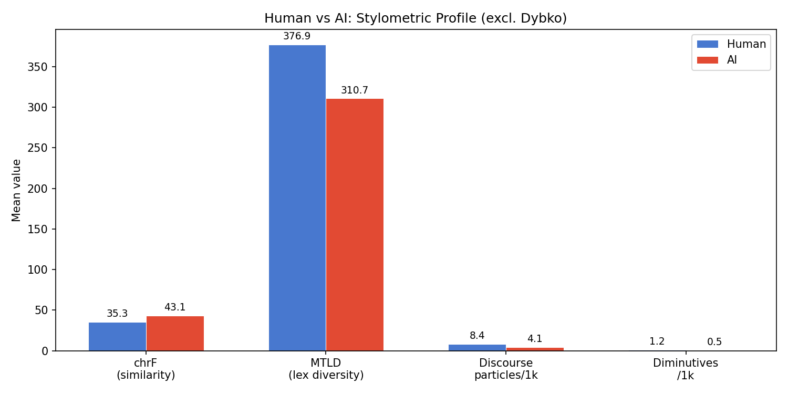

---

## 4. The Preference Reversal: LLM Judge Experiments

We ran two LLM-as-a-judge experiments using GPT-5.2 as the judge, computing TrueSkill ratings from pairwise comparisons.

### Experiment 1: Translation Quality (with English source)

The judge sees the English original and two Ukrainian translations, and picks the better translation.

### Experiment 2: Literary Quality (without English source)

The judge sees only two Ukrainian sentences and picks the one that "sounds more literary — as if written by a skilled Ukrainian author for a published book."

### The Reversal

| Rank | Metrics (COMETKiwi-22) | LLM Judge: Translation | LLM Judge: Literary | Human Eval |
|------|------------------------|----------------------|-------------------|---------------------|
| 1 | **LaPa** (0.820) | **GPT-5.2** (30.3) | Drozdovskyi 1991 (29.5) | Stelmakh 2021 (27.3) |
| 2 | **GPT-5.2** (0.812) | Stelmakh 2021 (29.8) | Stelmakh 2021 (28.6) | Shevchuk 1991 (26.4) |
| 3 | **DeepL** (0.805) | **DeepL** (29.2) | Shevchuk 1991 (26.6) | **DeepL** (26.4) |
| 4 | Stelmakh 2021 (0.775) | **LaPa** (27.4) | Okolitenko 1992 (25.2) | **GPT-5.2** (25.6) |
| 5 | Shevchuk 1991 (0.738) | Shevchuk 1991 (26.7) | Nosenok 2020 (24.7) | **LaPa** (25.4) |
| 6 | Cherniatynskyi 1947 (0.738) | Cherniatynskyi 1947 (25.0) | **GPT-5.2** (24.4) | Drozdovskyi 1991 (25.0) |
| 7 | Nosenok 2020 (0.727) | Drozdovskyi 1991 (24.0) | Cherniatynskyi 1947 (24.3) | Cherniatynskyi 1947 (24.4) |
| 8 | Drozdovskyi 1991 (0.693) | Nosenok 2020 (23.5) | **DeepL** (23.8) | Nosenok 2020 (24.4) |
| 9 | Okolitenko 1992 (0.672) | Okolitenko 1992 (21.4) | **LaPa** (22.4) | Okolitenko 1992 (23.1) |
| 10 | Dybko 1984 (0.541) | Dybko 1984 (13.9) | Dybko 1984 (21.4) | Dybko 1984 (18.2) |

*TrueSkill μ scores shown. Bold = AI systems. LLM judge: ~750 pairs each. Human eval: 762 matches.*

**Key observations:**

1. **When the source is visible** (Exp. 1), the LLM judge agrees with metrics: GPT-5.2 ranks #1, all three AI in top 4. The judge is measuring the same thing the metrics measure — semantic fidelity.

2. **When the source is hidden** (Exp. 2), AI systems collapse: GPT-5.2 drops from #1 to #6, DeepL from #3 to #8, LaPa from #4 to #9. Human translators take the top 5 positions — led by Drozdovskyi (#8 on metrics → #1 on literary judge).

3. **Human eval** (762 matches) tracks the literary judge more closely than the translation judge. Stelmakh tops human eval. AI systems land mid-pack — DeepL at #3, GPT-5.2 at #4, LaPa at #5.

4. **Dybko is universally last** across all four rankings, confirming her role as a sanity check.

5. **Drozdovskyi is the sharpest reversal** — #8 on COMETKiwi-22, #7 on translation judge, but #1 on literary judge. His particle-rich, diminutive-heavy style is exactly what metrics penalize and literary judgment rewards.

6. **Stelmakh is universally first or near-first** in every human/literary ranking — the translator who combines genuine Ukrainian literary voice with enough source fidelity to place #4 on metrics.

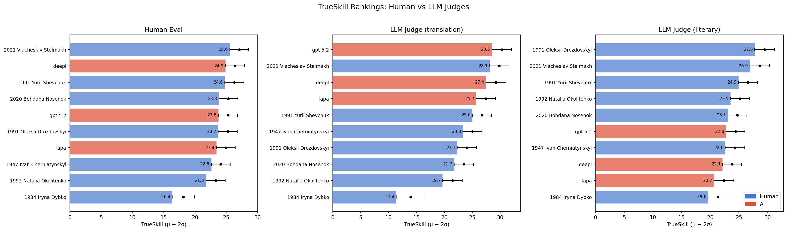

---

## 5. The Synthesis: Three Claims

### Claim 1: Metrics reward fidelity, not quality

Every automatic metric — neural (COMET, XCOMET, MetricX-24) and surface (chrF, BLEU) — places all three AI systems at the top. This is because AI translations are more source-literal (LaBSE similarity to source: AI avg 0.850 vs. human avg 0.733) and more similar to each other (AI-AI: 0.941 vs H-H: 0.711). Metrics trained on parallel corpora conflate source-closeness with quality.

The preference reversal proves this: when a judge evaluates the same translations without access to the source, AI drops and humans rise. The quality these metrics capture is not the quality that makes literary translation valuable.

### Claim 2: AI translations are expressively impoverished

Despite scoring highest on every metric, AI translations are measurably poorer on every dimension of Ukrainian literary expressiveness:

| Dimension | AI avg | Human avg (excl. Dybko) | Gap |
|-----------|:------:|:-----------------------:|:---:|
| MTLD (lexical diversity) | 311 | 377 | -18% |
| Hapax ratio | 0.182 | 0.215 | -15% |
| Discourse particles /1k | ~low | ~high | ~2x fewer |
| Diminutives /1k | 0.47 | 1.23 | -62% |
| Cosine Delta (stylometric dist.) | 1.062 | 1.120 | -5% |

These aren't noise — they're systematic deficits in the features that define Ukrainian literary prose. AI systems produce text that is semantically correct and syntactically fluent but culturally thin.

### Claim 3: AI translations converge; humans diverge

Three architecturally distinct AI systems — a general-purpose LLM (GPT-5.2), a commercial NMT system (DeepL), and a domain-tuned LLM (LaPa) — produce near-identical output:

| Measure | AI-AI | Human-Human | Ratio |
|---------|:-----:|:-----------:|:-----:|
| LaBSE cosine sim. | 0.941 | 0.711 | 1.32x |
| XCOMET round-robin | 0.886 | 0.627 | 1.41x |
| chrF mean pairwise | 43.1 | 33.7 | 1.28x |

Human translators genuinely diverge: they make different lexical choices, employ different registers, adapt cultural references differently. AI systems converge on the same "consensus average" — an optimization artifact, not a translation strategy.

This convergence is not just a curiosity. It means AI translation represents a single point in the space of possible translations, not a family of alternatives. Switching between AI systems does not solve the problem.

---

## 6. Hypothesis Status

| Hypothesis | Status | Key evidence |
|-----------|:------:|-------------|
| H1a: Metrics reward fidelity over quality | **Confirmed** | All 3 AI top-3 on metrics; preference reversal when source is hidden |
| H1b: Temporal bias | **Weak** | Cherniatynskyi (1947) scores mid-range, not bottom |
| H2a: AI lexically impoverished | **Confirmed** | -18% MTLD, -15% hapax ratio vs. human range |
| H2b: AI lacks Ukrainian identity | **Confirmed** | 2.6x fewer diminutives, ~2x fewer discourse particles |
| H2c: AI artificially consistent | **Confirmed** | Lowest word-ratio std; tightest metric score distributions |
| H2d: AI convergence | **Strongly confirmed** | LaBSE AI-AI 0.941 vs H-H 0.711; XCOMET AI-AI 0.886 vs H-H 0.627 |
| H3a: Training-data bubble | **Supported** | LLM judge with source agrees with metrics; without source disagrees |

---

## 7. What's Next

1. **Complete human evaluation** — the preliminary 449-match TrueSkill ranking aligns with the literary judge but needs more data for stable confidence intervals.
2. **Compute rank correlations** — Spearman ρ between metric rankings and human TrueSkill rankings to test the pre-registered falsifiability thresholds.
3. **AI-AI tie rate** — test whether human annotators can distinguish between the three AI translations (the embedding data predicts they cannot).
4. **Write paper** — the computational evidence is complete; integrate with human eval results for the final narrative.

---

## Appendix: Plot Index

| Plot | Path |
|------|------|
| Reference-free neural metrics | `plots/neural_metrics/ref_free_comparison.png` |
| Round-robin neural metrics | `plots/neural_metrics/round_robin_comparison.png` |
| Convergence (round-robin) | `plots/neural_metrics/convergence_round_robin.png` |
| COMET-22 heatmap | `plots/neural_metrics/heatmap_comet_22.png` |
| XCOMET heatmap | `plots/neural_metrics/heatmap_xcomet.png` |
| MetricX-24 heatmap | `plots/neural_metrics/heatmap_metricx_24.png` |
| LaBSE pairwise heatmap | `plots/labse/pairwise_heatmap.png` |
| LaBSE cluster averages | `plots/labse/cluster_averages.png` |
| LaBSE source similarity | `plots/labse/source_similarity.png` |
| Lexical diversity | `plots/stylometry/lexical_diversity.png` |
| Discourse particles | `plots/stylometry/discourse_particles.png` |
| Diminutives | `plots/stylometry/diminutives.png` |
| chrF / BLEU | `plots/stylometry/chrf_bleu.png` |
| Cosine Delta | `plots/stylometry/cosine_delta.png` |
| Word ratio | `plots/stylometry/word_ratio.png` |
| Convergence summary | `plots/stylometry/convergence_summary.png` |
| TrueSkill comparison | `plots/trueskill/trueskill_comparison.png` |
